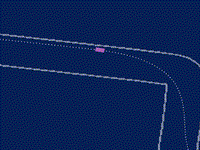
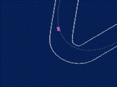
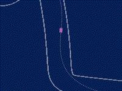
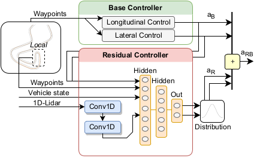
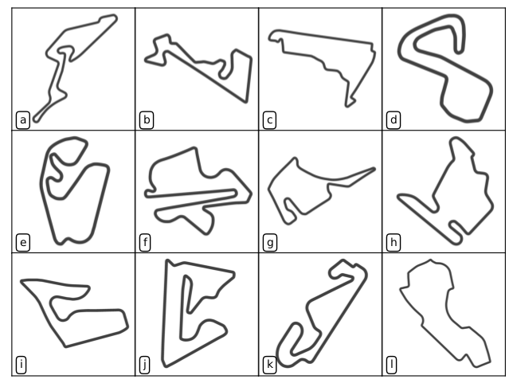

# Residual Policy Learning for Vehicle Control of Autonomous Racing Cars

[](https://github.com/RichardLitt/standard-readme)

This repository is the official implementation of the [paper](https://scholar.google.com/citations?view_op=view_citation&hl=en&user=2ttMbLQAAAAJ&citation_for_view=2ttMbLQAAAAJ:Tyk-4Ss8FVUC):

> **Residual Policy Learning for Vehicle Control of Autonomous Racing Cars**
>
> [Trumpp, Raphael](https://scholar.google.com/citations?user=2ttMbLQAAAAJ&hl=en), [Denis Hoornaert](https://scholar.google.com/citations?user=mGueMPgAAAAJ&hl=en&oi=ao), and [Marco Caccamo](https://scholar.google.com/citations?user=Jbo1MqwAAAAJ&hl=en&oi=ao).

The paper will be presented at the IEEE Intelligent Vehicle Symposium 2023. If you find our work useful, please consider [citing](#reference) it.

<p align="center">
  
  
  
</p>

## Table of contents
- [Background](#background)
- [Install](#install)
- [Usage](#usage)
- [Reference](#reference)
- [License](#license)

## Background
The development of vehicle controllers for autonomous racing is challenging because racing cars operate at their physical driving limit. 
Prompted by the demand for improved performance, autonomous racing research has seen the proliferation of machine learning-based controllers. 
While these approaches show competitive performance, their practical applicability is often limited. 
Residual policy learning promises to mitigate this by combining classical controllers with learned residual controllers. 
The critical advantage of residual controllers is their high adaptability parallel to the classical controller's stable behavior. 
We propose a residual vehicle controller for autonomous racing cars that learns to amend a classical controller for the path-following of racing lines. 
In an extensive study, performance gains of our approach are evaluated for a simulated car of the F1TENTH autonomous racing series. 
The evaluation for twelve replicated real-world racetracks shows that the residual controller reduces lap times by an average 
of 4.55 % compared to a classical controller and zero-shot generalizes to new racetracks.

### Residual Policy Learning
Proposed control architecture consisting of a base controller that outputs control action $a_{\text{B}}$ which is added to the 
residual action $a_{\text{R}}$ to form the combined action $a_{\text{RB}}$. The action $a_{\text{R}}$ of the
residual controller is sampled from a distribution whose parameters are defined by a NN.

<p align="center">
  
</p>
  
### Simulator and Racetracks
This repository uses an adapted version of the  [F1TENTH gym](https://github.com/f1tenth/f1tenth_gym) as simulator.
Map data of replicated real-world racetracks are used from the [F1TENTH maps](https://github.com/f1tenth/f1tenth_racetracks) repository.

Racetracks for training and testing: (a) Nurburgring, (b) Moscow Raceway, (c) Mexico City, (d) Brands Hatch, 
(e) Sao Paulo, (f) Sepang, (g) Hockenheim, (h) Budapest, (i) Spielberg, (j) Sakhir, (k) Catalunya, and (l) Melbourne.
<p align="center">
  
</p>

### Results: Lap times
#### Training:
| **Track**    | **Baseline in s** | **Residual in s** | **Improvement in s** | **Improvement in %** |
|--------------|-------------------|-------------------|----------------------|----------------------|
| Nuerburgring | 60.84             | 58.07             | 2.77                 | 4.55                 |
| Moscow       | 46.75             | 43.45             | 3.30                 | 7.06                 |
| Mexico City  | 49.12             | 46.76             | 2.36                 | 4.80                 |
| Brands Hatch | 45.92             | 44.97             | 0.95                 | 2.07                 |
| Sao Paulo    | 47.92             | 44.92             | 3.00                 | 6.26                 |
| Sepang       | 66.24             | 63.18             | 3.06                 | 4.62                 |
| Hockenheim   | 49.96             | 47.35             | 2.61                 | 5.22                 |
| Budapest     | 54.33             | 51.67             | 2.66                 | 4.90                 |
| Spielberg    | 45.33             | 43.93             | 1.40                 | 3.09                 |


#### Test:
| **Track** | **Baseline in s** | **Residual in s** | **Improvement in s** | **Improvement in %** |
|-----------|-------------------|-------------------|----------------------|----------------------|
| Sakhir    | 60.34             | 57.72             | 2.62                 | 4.34                 |
| Catalunya | 56.50             | 53.54             | 1.49                 | 5.24                 |
| Melbourne | 61.03             | 59.54             | 2.96                 | 2.44                 |

#### Overall:
| **Track** | **Baseline in s** | **Residual in s** | **Improvement in s** | **Improvement in %** |
|-----------|-------------------|-------------------|----------------------|----------------------|
| Average   | 53.69             | 50.85             | 2.43                 | 4.55                 |


## Install
- We recommend to use a virtual environment for the installation:
    ```bash
    python -m venv rpl4f110_env
    source rpl4f110_env/bin/activate
    ```
- Activate the environment and install the following packages:
    ```bash
    pip install torch
    pip install gymnasium
    pip install tensorboard
    pip install hydra-core
    pip install tqdm
    pip install flatdict
    pip install torchinfo
    pip install torchrl
    pip install numba
    pip install scipy
    pip install pyglet
    pip install pillow
    pip install pyglet==1.5
    ```
- The simulator should be installed as a module:
    ```bash
    cd simulator
    pip install -e .
    ```
## Usage
### Training
After setting you desired configuration in the [config.yaml](config.yaml) file, you can start the training by running:
```bash
python main.py
```
Specific names of the experiment can be set by running:
```bash
python main.py +exp_name=your_experiment_name
```
The use of your GPU can be avoided by running:
```bash
python main.py +cuda=False
```
### Monitoring
The training results are stored in the `outputs` folder. The training progress can be monitored with tensorboard:
```bash
tensorboard --logdir outputs
```
### Others
The baseline controller can be evaluated by running:
```bash
python main.py +bench_baseline=True
```

### Docstrings
Most of the code is documented with *automatically* generated docstrings, please use them with caution.

## Reference
If you find our work useful, please consider citing our paper:

```bibtex 
@inproceedings{trumpp2023residual,
author="Raphael Trumpp and Denis Hoornaert and Marco Caccamo",
title="Residual Policy Learning for Vehicle Control of Autonomous Racing Cars",
booktitle="2023 IEEE Intelligent Vehicles Symposium (IV) (IEEE IV 2023)",
address="Anchorage, USA",
days="4",
moth=jun,
year=2023,
keywords="Residual Policy Learning; Autonomous Racing; Vehicle Control; F1TENTH"
}
```

## License
[GNU General Public License v3.0 only" (GPL-3.0)](LICENSE.txt) © [raphajaner](https://github.com/raphajaner)
